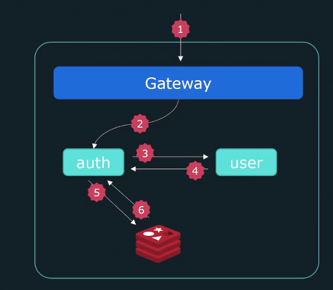
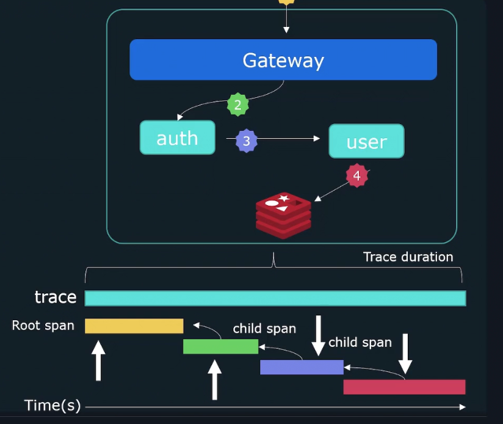
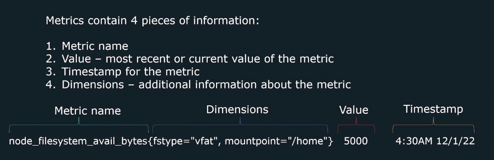
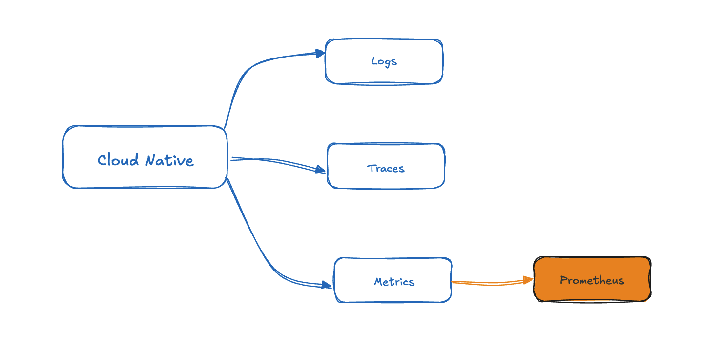

# Observability 

## What's Observability? 
- The ability to understand and measure the state of a system based upon data generated by the system. 
- Observability allows you to generate actionable outputs from **unexpected** scenarios in dynamic environments.
- Observability will help: 
  - Give better insight into the internal workings of a system/application
  - Speed up troubleshooting
  - Detect hard to catch problems
  - Monitor performance of an application
  - Improve cross-team collaboration

**The main purppose of observability is to better understand the internals of our system.**

As system architectures continue to get more and more complex, new challenges aris as tracking down issues become far more challenging. There is a greater need for observability as we move towards distributed systems & microservices based application. 

When it comes to **troubleshooting** issues, we need more information than just what is wrong. 

We need to know why our application entered a specific state, what component is responsible and how we can avoid it in the future.
- Why are error rates rising.
- Why is there high latency.
- Why are services timing out.
  
Observability gives us the flexiblity to understand unpredictable events. 

## 3 pillars of Observability 

Thress pillars of **Observability** are **Logging**, **Traces**, and **Metrics**. 

### **Logging** 
- **Logs** are records of events that have occured and encapsulate information about the specific event. 
- Logs are comprised of: 
  - Timestamp of when the log event occured. 
  - Message containing information. 
  
Logs are the most common form of observation produced by 
sytems. However, they can be difficult to use tde to the verbosity of the logs outputted by systems/applications. 
Logs of processes are likely to be interwoven with other concurrent processes spread across multiple systems. 

### **Traces**
-  

- 

- **Traces** - allows you to follow operations as they traverses through various systems & services. 
- With traces, we can follow an individual request and see it flow through our system hop by hop.
- Traces help us connect the **dots(services/containers)** on how processes and services work together. 
- Each trace has a **trace-id** that can be used to identify a request as it traverses the system.
- Individual events forming a trace are called **spans**. 
- Each span tracks the following: 
  - **Start time**
  - **Duration** 
  - **Parent-id**

### **Metrics** 

- Metrics provide information about the sate of a system using numerical values. 
  - CPU Load 
  - Number of open files 
  - HTTP response times
  - Number of errors 

THe data collected can be aggregated over time and graphed using visualization tools to identify **trends** over time. 

Metrics in the scope of Prometheus contain 4 pieces of information: 

- Metric name
- Value - most recent or current value of the metrics
- Timestamp of the metric 
- Dimensions - additional information about the specific about the metric

### Prometheus 

**Prometheus** is a monitoring solution that is responsible for collecting and aggregating **metrics**. Which means the topic we talk about on Observability is in the scope of Cloud Native and it contains three piliars - **Logging**, **Tracing**, and **Metrics**, and **Prometheus** is only in the scope of **Metrics**. 
