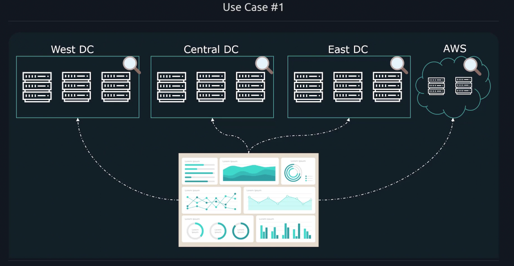
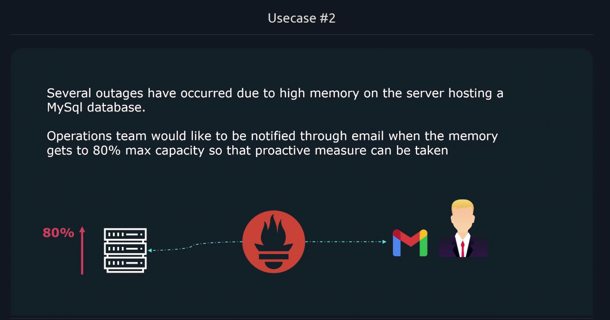

# Prometheus Use Cases 

## Use Case #1

Get insights into all of these data center, and collect metrics from all of these locations and have them all those statistics be presented on one clean dashboard.
With **Prometheus**, we can collect metrics from multiple data centers and Prometheus has built-in dashboarding utility we can use to represent all those data (metrics collected from multiple datacenters & cloud platforms) in a single page. 
 

## Use Case #2  

Several outages have occured due to high memory on the server hosting a MySql database. Operations team would like to be notified through email when the memory gets to 80% max capacity so that proactive measure can be taken. 

With **Prometheus**, once the metrics we configured attached to the threshold, Prometheus will send alert to configured users and send emails to them. 

 

## Use Case #3 

A new video upload feature has been added to the website, however there is some concerns about users uplaoding too large of videos. 

The team would liek to find out at which video length the application starts to degrade and to do this, they need a chart plotting the avg file of upload and the average latency per request. 

 