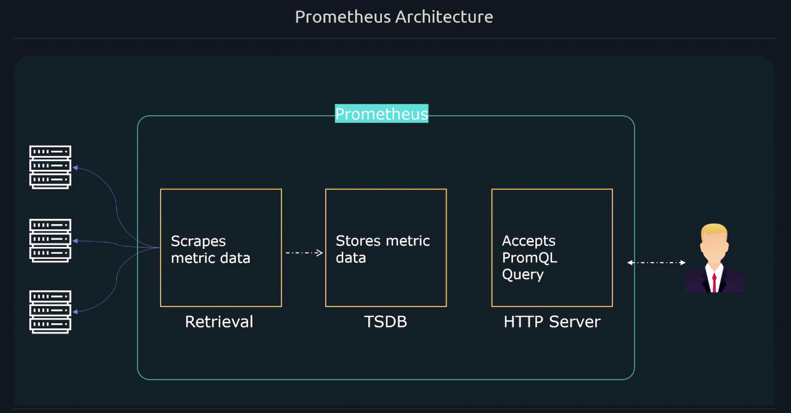
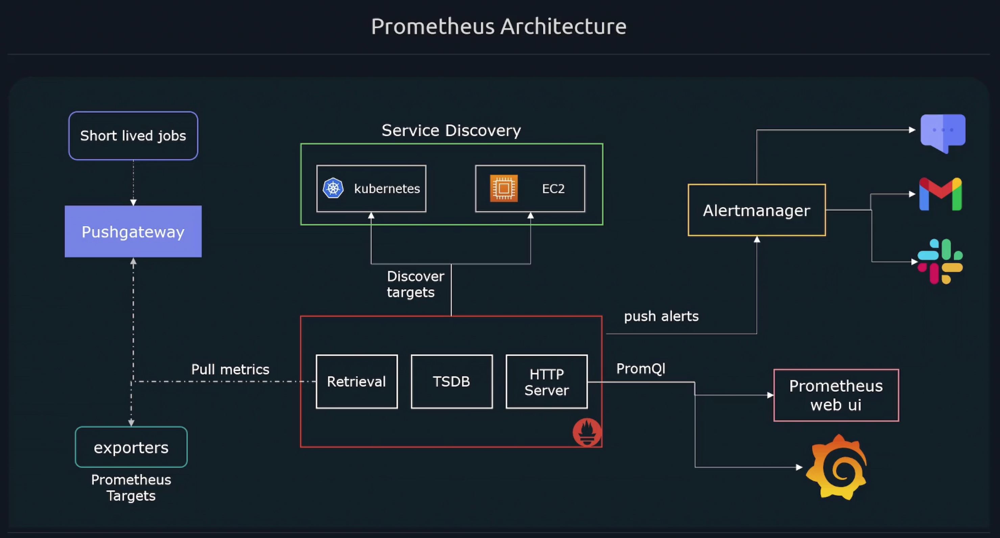

# Prometheus Architecture 

## How Prometheus Work 
- Prometheus collects metrics by sending http requests to `/metrics` endpoint of each target. 
- Prometheus also support to configure other path other than default metric endpoint path `/metrics`. 
- As we know most of microservice apps as the Prometheus Targets by default don't collect metrics and expose them on an HTTP endpoint to be consumed by a Prometheus server. 
- **Exporters** collect metrics and expose them in a format Prometheus expects. 
- Prometheus has several **native** exporters: 
  - Node exporters (Linux servers)
  - Windows 
  - MySQL
  - Apache 
  - HAProxy 

## What We Can Monitor in Application Metrics 
- Number of errors/exceptions 
- Latency of requests 
- Job execution time 

Prometheus comes with **client libraries** that allow you to expose any application metrics you need Prometheus to track. 

## Prometheus Based Model -- Pull Based Model 
- Prometheus supports a pull based model, which means Prometheus needs to have a list of all targets it should scrape.
- Other Pull based monitoring solutions include: 
  - Zabix 
  - nagios 
- Benefits of using a pull based system: 
  - Easier to tell if a target is down. 
  - In a pushed system, we don't know if its down or has been decommissioned. 
- Push based systems could potentially **overload** metrics server if too many incoming connections get flooded at same time. 
- Pull based systems have a defintive list of targets to monitor, creating a central source of truth. 

### Classic Scenarios We Adopt Push Model via Prometheus 
- event-based systems, pulling data wouldn't be a viable option. 
  - However, Prometheus is for collecting metrics and not monitoring events. 
  - Short lived jobs, as they may end before a pull can occur 
    - Prometheus has feature called **Pushgateway** to handle this situation. 

## Prometheus Based Model -- Push Based Model 
- Prometheus also supports a push based model, which means the targets are configured to push the metric data to the metrics server. 
- Pushed based systems include: 
  - Logstash 
  - Graphite 
  - OpenTSDB  