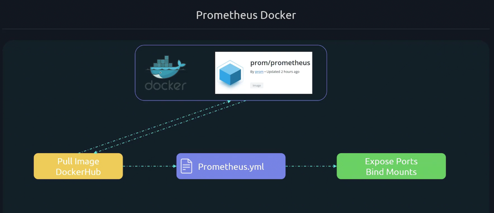

# Promtheus on Docker 




## Setup Prometheus on Docker 
- First we configure the `prometheus.yml` file 

`vim prometheus.yml`

```yml 
global:
scrape_configs:
  - job_name: "prometheus"
    static_configs:
      - targets: ["localhost:9090"]
```


- Second, we setup docker via command below: 
```shell 
docker run -d /path/to/prometheus.yml:/etc/prometheus/prometheus.yml -p 9090:9090 prom/prometheus 
```
