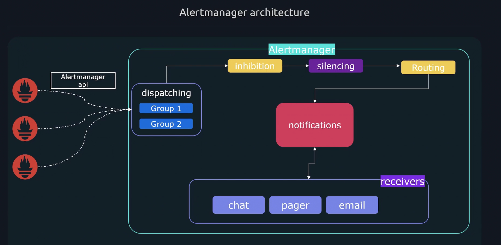

# Alertmanager Architecture 

## What is AlertManager ? 

Previously, we already introduced Prometheus is only responsible for declaring alerting rules, and triggering alerts generate events for alerts. Sending alert messages to receivers, or configuring receivers, or subscribing specific alert messages is not the duty of Prometheus. Then, Alertmanager is responsible for receiving alerts generated from Prometheus and converting them into **notifications**.

These notifications can include, pages, webhooks, email messages, and chat messages. 

 


## Alertmanager Configuration 


- alertmanager.yml 
```yml 
# Global section applies global configuration **across** all section which can be overwritten. 
global:
  smtp_smarthost: 'mail.example.com:25'
  smtp_from: 'test@gmail.com'

# The route section provides a set of rules to determine what alerts get matched up with which receivers 
route: 
  # default alert route, if not routes' items matched use this default route defintions 
  receiver: staff 
  group_by: ['alertname', 'job']


  routes:
  - match_re: 
      job: (node|windows)
    receiver: infra-email 
  - matchers: 
      job: kubernetes 
    receiver: k8s-slack 

# Here we declare a receiver contains one or more notifiers to forward lerts to users
receivers:
- name: 'k8s-slack'
  slack_configs:
  - channel: '#alerts'
    text: 'https://example.com/alerts/{{ .GroupLabels.app }}'
```

## Introduce Rute in Alertmanager Yaml File
- alertmanager.yml 

```yml 
route: 
  routes:
  - match_re:
      job: (node|windows)
    receiver: infra-email 

  - matchers:
      job: kubernetes # in this example, all alerts with the job="kuberntes" & severity="ticket" labels will match this alert route rule 
      severity: ticket 
    # then, the alerts that match will get sent to receiver k8s-slack 
    receiver: k8s-slack 
```

## Restarting Alertmanager 
As with Prometheus, Alertmanager does not automatically pickup changes to its config file. One of the following must be performed, for changes to take effect: 

- Restart Alertmanager 
- Send a SIGHUP
  - Sudo killall - HUP alertmanager 
- HTTP Post to /-/reload endpiont 

## Continue 
- alertmanager.yml 
```yml 
route:
  routes: 
  - receiver: alert-logs 
  - matcher:
      job: kubernetes 
    receiver: k8s-email 
```

What if we want an alert to match two routes. 

In this example, we want all alerts to be sent to the receiver **alert-logs** and then if it has the label **jobs=Kubernetes** it should also match the following line and be sent to **k8s-email** receiver. 

By default, the first amtching routes wins. So a specific alert would stop going down the route tree after the first match. 

To continue processing down the tree we can add continue: true. 


## Grouping 
By default Alertmanager will group all alerts for a route into a **single group**, which results in you receiving one big notification. 

- alertmanager.yml

```yml 
route:
  receiver: fallback-pager 
  group_by: [team]
  routes:
    - match: 
       team: infra 
      group_by: [region, env]
      receiver: infra-email
      routes: 
      - match:
          severity: page 
        receiver: infra-pager 
```