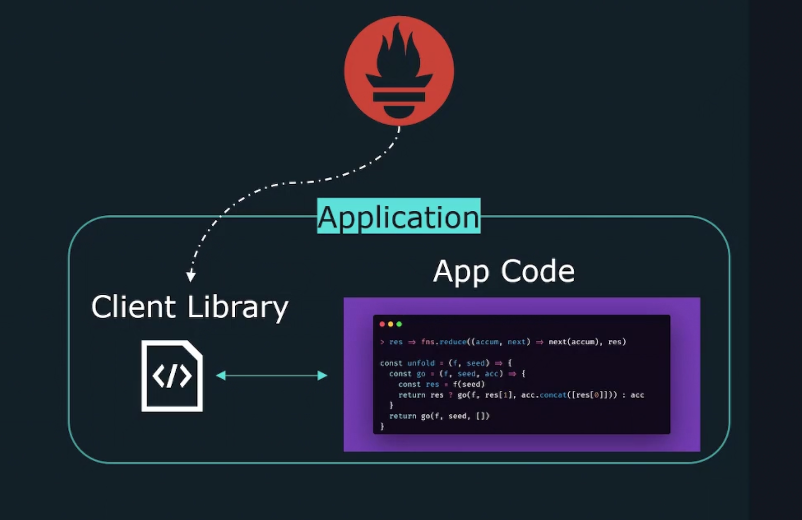

# Application Instrumentation 

## Client Libraries 
The Prometheus client libraries provide an easy way to add **instrumentation** to your code in order to trace and expose metrics for Prometheus. 

- Track metrics in the Prometheus expected format.
- Expose metrics via `/metrics` path. 

## Official Client Libraries 
Prometheus has official client libraries for the following languages:
- Go
- Java/Scala
- Python
- Ruby 
- Rust 

You can event write your own client library: 
- Unsupported language 
- Avoid dependencies 

