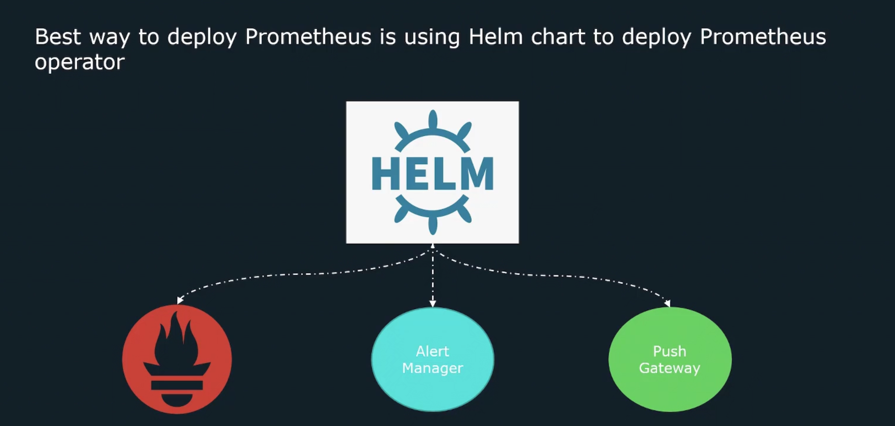

# Prometheus Monitor Kubernetes 
- Monitor applications running on Kubernetes infrastructure. 
- Monitor Kubernetes Cluster 
  - Control-Plane Components (api-server, coredns, kube-scheduler)
  - Kubelet(cAdvisor) - exposing container metrics
  - Kube-state-metrics - cluster level metrics (deployments, pod metrics)
  - Node-exporter - Run on all nodes for host related metrics (cpu, mem, network)    

## Kube-state-metrics 
To collect cluster level metrics (pods, deployments, etc) the kube-state-metrics container must be deployed. 


## Node Exporter 
Every host should run a `node_exporter` to expose cpu, memory, and network stats.  

We can manually go in and install a `node_exporter` on every node. 

Better option is to use a Kubernetes daemonSet - pod that runs on every node in the cluster. 


## How to Deploy Prometheus on Kubernetes 
Manually deploy Prometheus on Kubernetes - Create all the deployments, services, configMaps, and secrets.
But this is a complex, requires a lot of configuration, it is not the easiest soltuion. 

Best way to deploy Prometheus is using Helm Chart to deploy Prometheus operator. 


### What is Helm ? 
- Helm is a package manager for Kubernetes. 
- All application and Kubernetes configs necessary for an application can be bundled into a package and easily deployed. 

## Helm Charts 

A **helm chart** is a collection of template & YAML files that convert into Kubernetes manifest files. 

Helm charts can be **shared** with others by uploading a chart to a repository. 

Deploy prometheus on Kubernetes, this repo of [kube-prometheus-stack](https://github.com/prometheus-community/helm-charts/tree/main/charts/kube-prometheus-stack) is often adopted, and it has everything we gonna need to deploy prometheus on Kubernetes. 


## Kube-Prometheus-Stack 
The **Kube-Prometheus-Stack** chart makes use of the Prometheus Operator.

A Kubernetes **operator** is an application-specific controller that extends the K8S API to create `/configure/manage` instances of complex applications(like Prometheus!). 


## Prometheus Operator 
The Prometheus operator has several **custom resources** to aid the deployment and management of a Prometheus instance. 

- prometheus.yml 
```yml 
apiVersion: monitoring.coreos.com/v1
kind: Prometheus
metadata: 
  annotations:
    meta.helm.sh/release-name: prometheus
    meta.helm.sh/release-namespace: default 
  creationTimestamp: "xx"
  generation: 1
  labels: 
    app: kube-promethes-stack-prometheus
  name: prometheus-kube-prometheus-prometheus 
spec:
  alerting:
    alertmanagers:
    - apiVersion: v2
      name: prometheus-kube-prometheus-alertmanager 
      namespace: default
      pathPrefix: / 
      port: http-web 
```